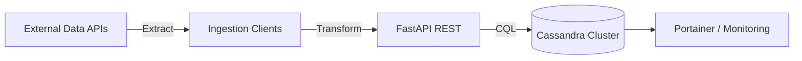
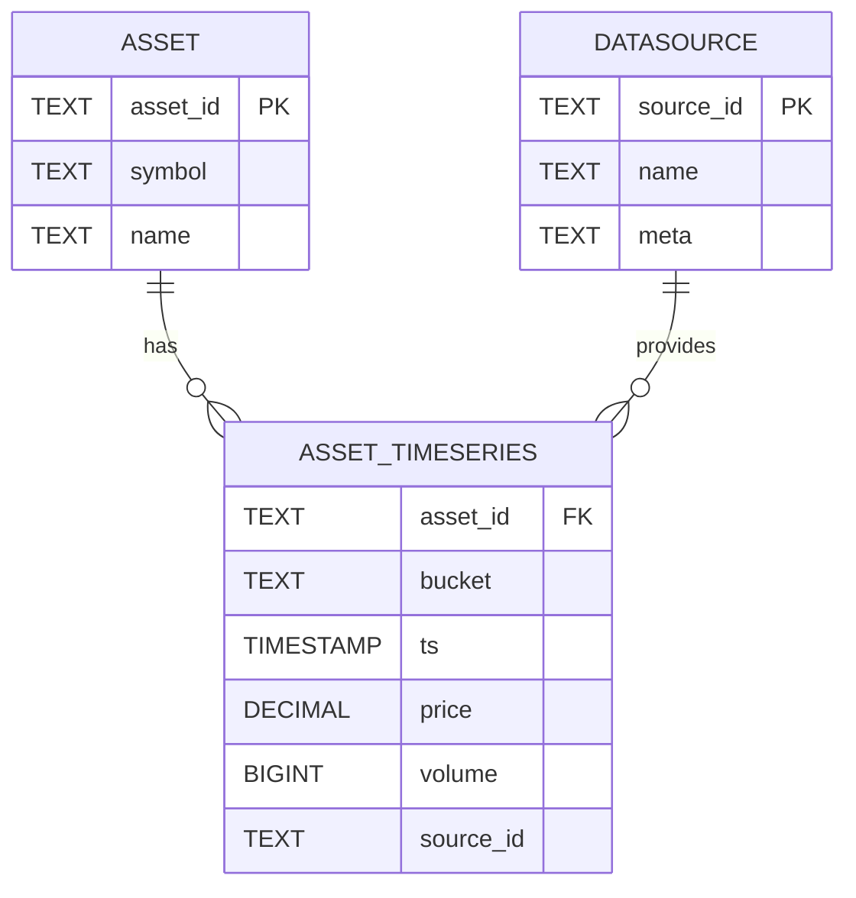
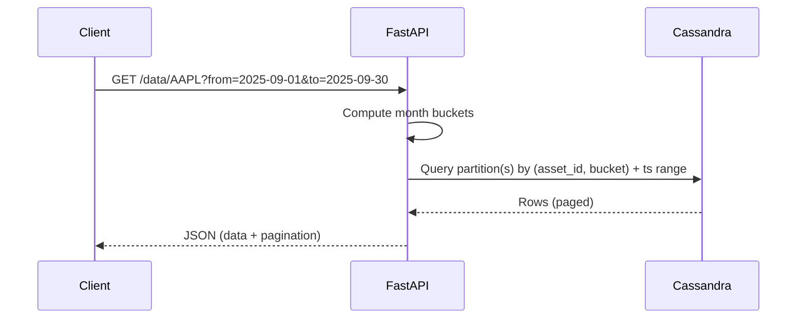

# Financial Data Warehouse – Interview Diagrams & Slide Snippets

Use these visuals directly in your slides or screen-share. I’ve included: (1) copy‑pasteable ASCII diagrams that render
anywhere, and (2) Mermaid snippets for nicer diagrams in tools that support Mermaid (GitHub, Notion, many slide tools).

---

## 1) High‑Level (Non‑Technical) View

**One‑liner:** “Netflix for financial data: a receptionist (API) fetches movies (prices) from a warehouse with 3 doors (
Cassandra nodes). If one door jams, the other doors still serve.”

**ASCII diagram (drop in slides or README):**

```
           Clients (Analysts, Dashboards, Services)
                           |
                           v
                    +--------------+
                    |   FastAPI    |   "Receptionist"
                    +--------------+
                           |
        ---------------------------------------------
        |                      |                     |
        v                      v                     v
 +-------------+        +-------------+        +-------------+
 | Cassandra   |        | Cassandra   |        | Cassandra   |
 |   Node 1    |  <-->  |   Node 2    |  <-->  |   Node 3    |
 +-------------+        +-------------+        +-------------+
    ^        ^              ^       ^             ^       ^
    |        |              |       |             |       |
    +--------+--------------+-------+-------------+-------+
                          Network / Replication
```

**Slide caption:**

* **Reliable**: if one node fails, the others serve data.
* **Scalable**: add nodes to grow capacity.
* **Fast**: data is organized for quick lookups.

**Mermaid (optional prettier version):**

```mermaid
flowchart TB
    C[Clients: Analysts / Apps] --> A[FastAPI Service]
    A --> N1[Cassandra Node 1]
    A --> N2[Cassandra Node 2]
    A --> N3[Cassandra Node 3]
    N1 <--> N2
    N2 <--> N3
    N1 <--> N3
    classDef emphasis fill: #e7f5ff, stroke: #5b9bd5;
    class A emphasis
```

---

## 2) Technical Architecture (Engineer View)

**ASCII diagram:**

```
[External Data APIs]
     |  (Extract)
     v
+------------------+      Transform/Validate      +------------------+
|  Ingestion       |  ------------------------->  |  FastAPI         |
|  Clients         |                              |  (REST + DTOs)   |
+------------------+                              +---------+--------+
                                                       |  (CQL)
                                                       v
                                           +-------------------------+
                                           |  Cassandra Cluster      |
                                           |  RF=3, QUORUM R/W       |
                                           |  TWCS, TTL (time-series) |
                                           +-----------+-------------+
                                                       |
                                                       v
                                               [Portainer / Ops]
```

**Talking cues:**

* **ETL path**: Extract → Transform (normalize schema, types) → Load (idempotent upserts).
* **API**: pagination today; range queries on roadmap.
* **Ops**: Docker Compose, Portainer; future: Prometheus + Grafana.

**Mermaid:**



---

## 3) Data Model & Partitions (Cassandra)

**Table shape (example time‑series table):**

```
TABLE asset_timeseries (
  asset_id TEXT,
  bucket   TEXT,         -- e.g., '2025-09'
  ts       TIMESTAMP,    -- clustering, ascending
  price    DECIMAL,
  volume   BIGINT,
  source_id TEXT,
  PRIMARY KEY ((asset_id, bucket), ts)
) WITH compaction = {'class':'TimeWindowCompactionStrategy'}
  AND default_time_to_live = <optional>;
```

**ASCII partitioning sketch:**

```
Partition (AAPL, 2025-09)
  ts -> 2025-09-01T10:00  price 189.1  vol 12000
        2025-09-01T10:01  price 189.2  vol 11850
        ... (sorted by ts) ...

Partition (AAPL, 2025-10)
  ts -> 2025-10-01T10:00  ...
```

**Why this works:** bounded partitions (by month), ordered clustering → efficient range scans; even load distribution →
avoids hot spots.

**Mermaid ER (logical view):**



---

## 4) Read/Write Flow (Sequence)

**ASCII sequence:**

```
Client -> FastAPI: GET /api/v1/data/AAPL?from=2025-09-01&to=2025-09-30
FastAPI -> FastAPI: compute buckets [2025-09]
FastAPI -> Cassandra: SELECT * FROM asset_timeseries
                      WHERE asset_id='AAPL'
                        AND bucket='2025-09'
                        AND ts >= from AND ts <= to
Cassandra --> FastAPI: rows (paged)
FastAPI --> Client: JSON (limit + next_page token / offset)
```

**Mermaid sequence:**



---

## 5) Deployment Topology

**ASCII (Docker Compose net):**

```
+-------------------+             +-------------------+
|   FastAPI         |  ------->   |  cassandra-dc1n1  |
|   (container)     |             +-------------------+
|                   |  ------->   |  cassandra-dc1n2  |
+-------------------+             +-------------------+
                           \-->   |  cassandra-dc1n3  |
                                   +-------------------+

+-------------------+
|  Portainer        |
+-------------------+
```

**Notes:** expose CQL ports, define seed node, RF=3 in prod; QUORUM consistency for correctness.

---

## 6) Slide Text Blocks (copy‑ready)

**Problem**: write‑heavy time‑series; must be fast, scalable, highly available.

**Solution**: FastAPI + Cassandra cluster; partition‑aware schema; idempotent ingestion.

**Benefits**: predictable latency, horizontal scale, node failure tolerance.

**Roadmap**: range queries & cursor pagination; async ingestion; lakehouse for analytics; OAuth2/JWT.

---

## 7) Bonus: Presenter Notes (30‑sec per slide)

* **Slide 1 (Title)**: One‑liner and value prop.
* **Slide 2 (Problem)**: Data characteristics + NFRs (scale, HA, latency).
* **Slide 3 (Non‑Tech)**: Netflix/warehouse analogy.
* **Slide 4 (Architecture)**: ETL → API → Cassandra → Ops.
* **Slide 5 (Data Model)**: (asset\_id, month\_bucket) + ts; TWCS + TTL.
* **Slide 6 (API)**: show 2–3 curl examples; mention pagination.
* **Slide 7 (Reliability)**: RF=3, QUORUM, idempotency, backfill safety.
* **Slide 8 (Roadmap)**: range queries, async, lakehouse, auth.

---

# Deep Technical Appendix (Copy‑ready for interview)

## A. Cassandra Keyspace & Tables (CQL)

**Local/dev (1 DC, 3 nodes):**

```sql
-- Keyspace (dev): SimpleStrategy for a single DC lab cluster
CREATE
KEYSPACE IF NOT EXISTS market
WITH replication = {
  'class': 'SimpleStrategy',
  'replication_factor': 3
};

-- In production prefer NetworkTopologyStrategy per DC, e.g.:
-- CREATE KEYSPACE market WITH replication = {
--   'class': 'NetworkTopologyStrategy', 'DC1': 3
-- } AND durable_writes = true;
```

**Reference tables:**

```sql
USE
market;

CREATE TABLE IF NOT EXISTS assets
(
    asset_id
    text
    PRIMARY
    KEY, -- e.g., 'AAPL'
    symbol
    text,
    name
    text,
    meta
    map<
    text,
    text>
);

CREATE TABLE IF NOT EXISTS data_sources
(
    source_id
    text
    PRIMARY
    KEY, -- e.g., 'nasdaq'
    name
    text,
    url
    text,
    meta
    map<
    text,
    text>
);

-- Time-series partitioned by month bucket for bounded partitions
CREATE TABLE IF NOT EXISTS asset_timeseries
(
    asset_id
    text,
    bucket
    text,      -- 'YYYY-MM'
    ts
    timestamp, -- clustering ASC for range scans
    price
    decimal,
    volume
    bigint,
    source_id
    text,
    PRIMARY
    KEY (
(
    asset_id,
    bucket
), ts)
    ) WITH CLUSTERING ORDER BY (ts ASC)
    AND compaction = {
    'class':'TimeWindowCompactionStrategy',
    'compaction_window_unit':'DAYS',
    'compaction_window_size':'1'
    }
    AND gc_grace_seconds = 86400 -- 1 day
    AND comment = 'Minute/hour/day bars by asset/month';

-- Optional: commodities in a parallel table
CREATE TABLE IF NOT EXISTS commodity_timeseries
(
    commodity_id
    text, -- e.g., 'brent'
    bucket
    text,
    ts
    timestamp,
    price
    decimal,
    volume
    bigint,
    source_id
    text,
    PRIMARY
    KEY (
(
    commodity_id,
    bucket
), ts)
    ) WITH CLUSTERING ORDER BY (ts ASC)
    AND compaction = {
    'class':'TimeWindowCompactionStrategy',
    'compaction_window_unit':'DAYS',
    'compaction_window_size':'1'
    };

-- Optional read-optimized table for the latest quote per asset
CREATE TABLE IF NOT EXISTS latest_quote_by_asset
(
    asset_id
    text
    PRIMARY
    KEY,
    ts
    timestamp,
    price
    decimal,
    volume
    bigint,
    bucket
    text,
    source_id
    text
);
```

**Why this design works (quick bullets):**

* Bucketing by month bounds partition size; clustering by `ts` gives ordered scans.
* TWCS compaction matches time-series write patterns; small compaction windows keep read amplification low.
* `latest_quote_by_asset` avoids `LIMIT 1` over a wide time range.

---

## B. Docker Compose – 3 Cassandra nodes + FastAPI + Portainer

```yaml
version: '3.8'
services:
  cassandra-dc1n1:
    image: cassandra:4.1
    container_name: cassandra-dc1n1
    environment:
      - CASSANDRA_CLUSTER_NAME=MarketCluster
      - CASSANDRA_DC=DC1
      - CASSANDRA_RACK=R1
      - CASSANDRA_SEEDS=cassandra-dc1n1
      - MAX_HEAP_SIZE=1G
      - HEAP_NEWSIZE=256M
    ports:
      - "9042:9042"
    volumes:
      - dc1n1_data:/var/lib/cassandra

  cassandra-dc1n2:
    image: cassandra:4.1
    container_name: cassandra-dc1n2
    environment:
      - CASSANDRA_CLUSTER_NAME=MarketCluster
      - CASSANDRA_DC=DC1
      - CASSANDRA_RACK=R1
      - CASSANDRA_SEEDS=cassandra-dc1n1
    depends_on:
      - cassandra-dc1n1
    volumes:
      - dc1n2_data:/var/lib/cassandra

  cassandra-dc1n3:
    image: cassandra:4.1
    container_name: cassandra-dc1n3
    environment:
      - CASSANDRA_CLUSTER_NAME=MarketCluster
      - CASSANDRA_DC=DC1
      - CASSANDRA_RACK=R1
      - CASSANDRA_SEEDS=cassandra-dc1n1
    depends_on:
      - cassandra-dc1n1
    volumes:
      - dc1n3_data:/var/lib/cassandra

  api:
    build: ./src
    container_name: market-api
    environment:
      - CASSANDRA_CONTACT_POINTS=cassandra-dc1n1,cassandra-dc1n2,cassandra-dc1n3
      - CASSANDRA_KEYSPACE=market
      - READ_CONSISTENCY=LOCAL_QUORUM
      - WRITE_CONSISTENCY=LOCAL_QUORUM
      - PAGE_SIZE=500
    ports:
      - "8000:8000"
    depends_on:
      - cassandra-dc1n1
      - cassandra-dc1n2
      - cassandra-dc1n3

  portainer:
    image: portainer/portainer-ce:latest
    container_name: portainer
    ports:
      - "9000:9000"
    volumes:
      - portainer_data:/data

volumes:
  dc1n1_data:
  dc1n2_data:
  dc1n3_data:
  portainer_data:
```

Notes:

* Expose only `9042` and API `8000` to host; nodes 2–3 can be internal.
* In prod use `NetworkTopologyStrategy`, `LOCAL_QUORUM` in multi‑DC.

---

## C. FastAPI – Range Queries + Cursor Pagination (server-side)

**Models & wiring (Python skeleton):**

```python
# app/main.py
from fastapi import FastAPI, HTTPException, Query
from pydantic import BaseModel, Field
from datetime import datetime, timezone
from typing import List, Optional
import base64, json

from cassandra.cluster import Cluster, ExecutionProfile
from cassandra.policies import RoundRobinPolicy, SpeculativeExecutionPolicy
from cassandra.query import SimpleStatement, ConsistencyLevel

app = FastAPI(title="Market API")

CONTACT_POINTS = [h.strip() for h in os.getenv("CASSANDRA_CONTACT_POINTS", "localhost").split(",")]
KEYSPACE = os.getenv("CASSANDRA_KEYSPACE", "market")
PAGE_SIZE = int(os.getenv("PAGE_SIZE", "500"))

cluster = Cluster(contact_points=CONTACT_POINTS,
                  execution_profiles={
                      'default': ExecutionProfile(
                          load_balancing_policy=RoundRobinPolicy(),
                          speculative_execution_policy=SpeculativeExecutionPolicy(max_attempts=2, delay=0.1)
                      )
                  })
session = cluster.connect(KEYSPACE)

SELECT_TS = session.prepare(
    """
    SELECT ts, price, volume, source_id
    FROM asset_timeseries
    WHERE asset_id = ? AND bucket = ? AND ts >= ? AND ts <= ?
    """
)
SELECT_TS.default_consistency_level = ConsistencyLevel.LOCAL_QUORUM


class PricePoint(BaseModel):
    ts: datetime
    price: float
    volume: int | None = None
    source_id: str | None = None


class Page(BaseModel):
    items: List[PricePoint]
    next_page_token: Optional[str] = None


# Helpers
from datetime import date


def month_buckets(start: datetime, end: datetime) -> List[str]:
    buckets = []
    y, m = start.year, start.month
    while (y < end.year) or (y == end.year and m <= end.month):
        buckets.append(f"{y:04d}-{m:02d}")
        if m == 12:
            y, m = y + 1, 1
        else:
            m += 1
    return buckets


# Token encoding: {"i": bucket_index, "ps": paging_state_base64}

def encode_token(i: int, ps: Optional[bytes]) -> str:
    payload = {"i": i, "ps": base64.b64encode(ps).decode() if ps else None}
    return base64.b64encode(json.dumps(payload).encode()).decode()


def decode_token(tok: str) -> dict:
    return json.loads(base64.b64decode(tok.encode()).decode())


@app.get("/api/v1/data/{asset_id}", response_model=Page)
async def get_data(asset_id: str,
                   from_: datetime = Query(..., alias="from"),
                   to: datetime = Query(...),
                   limit: int = Query(100, ge=1, le=5000),
                   page_token: Optional[str] = None):
    if to < from_:
        raise HTTPException(400, detail="'to' must be >= 'from'")

    buckets = month_buckets(from_, to)
    i, paging_state = 0, None
    if page_token:
        dt = decode_token(page_token)
        i = dt.get("i", 0)
        ps = dt.get("ps")
        paging_state = base64.b64decode(ps) if ps else None

    out: List[PricePoint] = []
    remaining = limit

    while i < len(buckets) and remaining > 0:
        b = buckets[i]
        # bucket-local time bounds
        b_start = datetime(from_.year, from_.month, 1, tzinfo=timezone.utc) if i == 0 else datetime.strptime(b + "-01",
                                                                                                             "%Y-%m-%d").replace(
            tzinfo=timezone.utc)
        b_end = to if i == len(buckets) - 1 else (datetime.strptime(b + "-01", "%Y-%m-%d").replace(
            tzinfo=timezone.utc).replace(day=28) + timedelta(days=4)).replace(day=1) - timedelta(milliseconds=1)

        stmt = SELECT_TS.bind((asset_id, b, from_ if i == 0 else b_start, to if i == len(buckets) - 1 else b_end))
        rs = session.execute(stmt, paging_state=paging_state, fetch_size=min(PAGE_SIZE, remaining))

        for row in rs.current_rows:
            out.append(PricePoint(ts=row.ts, price=float(row.price), volume=row.volume, source_id=row.source_id))
            remaining -= 1
            if remaining == 0:
                # Save paging state at this bucket
                if rs.has_more_pages:
                    return Page(items=out, next_page_token=encode_token(i, rs.paging_state))
                else:
                    # advance to next bucket
                    i += 1
                    if i < len(buckets):
                        return Page(items=out, next_page_token=encode_token(i, None))
                    return Page(items=out)

        # exhausted this bucket
        if rs.has_more_pages:
            # still more rows in same bucket, but we ran through current page
            return Page(items=out, next_page_token=encode_token(i, rs.paging_state))
        i += 1

    return Page(items=out)
```

**Key ideas to narrate:**

* Single‑partition queries (by `(asset_id, bucket)`) keep reads fast.
* Cursor token encodes both **which bucket** you’re on and Cassandra’s **paging state**.
* Server controls `fetch_size` to avoid oversized responses; client passes back `page_token`.

---

## D. Ingestion – Idempotent Upserts & Backpressure

**Upsert pattern:**

```python
INSERT_TS = session.prepare(
    """
    INSERT INTO asset_timeseries (asset_id, bucket, ts, price, volume, source_id)
    VALUES (?, ?, ?, ?, ?, ?)
    """
)
INSERT_TS.is_idempotent = True


async def load_points(asset_id, points, source_id):
    # points: iterable of (ts, price, volume)
    by_bucket = defaultdict(list)
    for ts, price, vol in points:
        b = ts.strftime('%Y-%m')
        by_bucket[b].append((ts, price, vol))

    sem = asyncio.Semaphore(32)  # backpressure: 32 inflight statements

    async def write_one(b, ts, price, vol):
        async with sem:
            session.execute_async(INSERT_TS, (asset_id, b, ts, price, vol, source_id))

    await asyncio.gather(*(write_one(b, *row) for b, rows in by_bucket.items() for row in rows))
```

**Resilience:**

* Use idempotent prepared statements → safe to retry.
* Limit concurrency with a semaphore to protect the cluster.
* Batch *only* for the same partition if needed; avoid unbounded logged batches.

---

## E. Observability & SRE Notes

**FastAPI basic Prometheus metrics:**

```python
from prometheus_client import Counter, Histogram, generate_latest
from fastapi import Response

REQS = Counter('api_requests_total', 'Total API requests', ['path', 'method', 'status'])
LAT = Histogram('api_latency_seconds', 'Latency', ['path', 'method'])


@app.middleware("http")
async def metrics_middleware(request, call_next):
    start = time.perf_counter()
    resp = await call_next(request)
    LAT.labels(request.url.path, request.method).observe(time.perf_counter() - start)
    REQS.labels(request.url.path, request.method, resp.status_code).inc()
    return resp


@app.get('/metrics')
def metrics():
    return Response(generate_latest(), media_type='text/plain')
```

**Cassandra metrics to watch (via JMX/Exporter):**

* `org.apache.cassandra.metrics:type=ClientRequest,scope=Read,name=Latency`
* `CompactionExecutor` pending tasks
* `Table` metrics: SSTables per read, Bloom filter false positives

**Runbook (fail a node):**

1. `docker stop cassandra-dc1n2` → API still serves (RF=3, LOCAL\_QUORUM).
2. Observe read latency bump; compaction/backlog.
3. `docker start cassandra-dc1n2` → node streams; watch `PendingCompactions`.

---

## F. Capacity Planning Quick Math

* **Rows per month per asset** (US equities, 1‑min bars): \~390 bars/day × \~21 trading days ≈ **8,190 rows**.
* **Partition size target**: keep < **100 MB** (rule of thumb). With \~8k rows and \~100–200 bytes/row incl. overhead →
  \~0.8–1.6 MB/partition → very safe.
* **Throughput**: 1,000 assets × 8k rows/month ≈ **8M rows/month**; \~260k/day; \~3 r/s sustained → trivial for
  Cassandra; spikes handled by buffering + backpressure.

---

## G. Security & Governance

* **Input validation**: strict date parsing; 400 on invalid ranges; max range guard (e.g., 400k points cap).
* **Auth**: OAuth2/JWT at API gateway; per‑route scopes (read\:data, read\:assets).
* **Rate limiting**: e.g., `slowapi` or gateway (NGINX/Traefik) token bucket (e.g., 100 r/m per client).
* **Provenance**: every write records `source_id`; optional checksum to detect upstream drift.

---

## H. Testing Strategy

* **Unit**: Pydantic models, bucket math, token encode/decode, date bounds.
* **Integration**: Spin Cassandra via docker in CI, apply DDL, seed a tiny fixture, hit endpoints.
* **Contract**: JSON schema for responses; negative tests for 400/404.

---

## I. Multi‑DC & Consistency Talking Points

* Use `NetworkTopologyStrategy` with `DC1:3, DC2:3`.
* Clients use LOCAL\_QUORUM in each DC; failover with smart LB policy.
* Repair cadence: incremental repair weekly; node replace procedure ready.
* Disaster recovery: snapshot to object storage + commit logs; restore playbook.

---

## J. Demo Script (5–7 minutes)

```bash
# 1) Bring up infra
docker compose up -d

# 2) Initialize schema
cqlsh localhost 9042 -e "SOURCE '/init/market_ddl.cql'"

# 3) Seed a tiny dataset (AAPL + BRENT)
python -m scripts.seed --assets AAPL --commodities brent --from 2025-08-01 --to 2025-08-31

# 4) Smoke test API
curl 'http://localhost:8000/api/v1/assets?limit=5&offset=0'

# 5) Range + cursor demo
curl 'http://localhost:8000/api/v1/data/AAPL?from=2025-08-01&to=2025-08-31&limit=100'
# -> copy next_page_token and fetch next page
curl 'http://localhost:8000/api/v1/data/AAPL?from=2025-08-01&to=2025-08-31&limit=100&page_token=...'

# 6) Fault tolerance: stop a node, repeat request
docker stop cassandra-dc1n2
curl 'http://localhost:8000/api/v1/data/AAPL?from=2025-08-01&to=2025-08-31&limit=100'
```

---

# Non‑Technical Script (Plain‑English)

**What it is:** A system that **collects**, **stores**, and **delivers** price history for stocks and commodities.

**Everyday analogy:**

* The **API** is a receptionist.
* The **database** is a warehouse with **three doors** (three servers). If one door gets stuck, the other two still
  serve customers.
* Data arrives by **trucks** (ingestion), gets placed on **shelves by month** (so it’s easy to find), and customers can
  ask for “AAPL prices in August”.

**Why it’s useful:**

* Analysts and apps get answers **fast** and **reliably**.
* The warehouse can get **bigger** simply by adding more shelves and doors (more servers).

**How it keeps running:**

* The system keeps **three copies** of each item. If a server fails, the others still respond.
* It organizes items **by month** so workers find them quickly.

**What’s next:**

* Let users ask for a **date range** directly.
* Add **logins** and **permissions**.
* Connect a **dashboard** that shows health and speed.

**1‑minute closing line:**

> “We built a reliable, scalable backbone for financial data. It’s easy to grow, it stays online when parts fail, and it
> answers the exact questions analysts ask—quickly.”
